[Back to list](./../readme.md)

[Task Definition](./task/readme.md)

# Terraform for AWS

- S3 Bucket for state
- Dynamydb for lock (only one person can works)
- VPC public (3 items) and private (3 items) subnets
- ECR (Elastic Container Registry) for Docker-images.
- Elastic IP (1 item)
- NAT Gateway (for Internet access from private subnets)
- EKS (Elastic Kubernetes Service)
- Jenkins (for build and push docker container to ECR)
- ArgoCD (sync cluster-kuber django-app, if git codebase was changed, like new PR in main branch )
- RDS module
- `new` monitoring

### Tech Stach

 - Infrastructure as Code `Terraform`
 - Cloud Provider `AWS (EKS, ECR, VPC, S3, DynamoDB)`
 - Kubernetes `Amazon EKS (t3.small nodes)`
 - CI (Image Build) `Jenkins + Kaniko`
 - CD (Deployment) `Argo CD`
 - Package Manager `Helm`
 - Application `Django + PostgreSQL`
 - Image Registry `Amazon ECRDatabaseAmazon RDS (PostgreSQL / Aurora)`
 - Monitoring (Prometeus, Grafana)

### CI/CD schema (FLOW)

```
change code in GitHub
       │
       ▼
  Jenkins Pipeline
  ┌─────────────────────────────────┐
  │ 1. Kaniko: build Docker-image   │
  │ 2. push in to AWS ECR           │
  │ 3. update tag in values.yaml    │
  │ 4. push changes in GitHub       │
  └─────────────────────────────────┘
       │
       ▼
  Git repo (values.yaml updated)
       │
       ▼
  Argo CD (automatically detects changes)
       │
       ▼
  Kubernetes (EKS): start to deploy a new version + monitoring
```

### Project Structure

```
Project/
│
├── main.tf         # Головний файл для підключення модулів
├── backend.tf        # Налаштування бекенду для стейтів (S3 + DynamoDB
├── outputs.tf        # Загальні виводи ресурсів
│
├── modules/         # Каталог з усіма модулями
│  ├── s3-backend/     # Модуль для S3 та DynamoDB
│  │  ├── s3.tf      # Створення S3-бакета
│  │  ├── dynamodb.tf   # Створення DynamoDB
│  │  ├── variables.tf   # Змінні для S3
│  │  └── outputs.tf    # Виведення інформації про S3 та DynamoDB
│  │
│  ├── vpc/         # Модуль для VPC
│  │  ├── vpc.tf      # Створення VPC, підмереж, Internet Gateway
│  │  ├── routes.tf    # Налаштування маршрутизації
│  │  ├── variables.tf   # Змінні для VPC
│  │  └── outputs.tf  
│  ├── ecr/         # Модуль для ECR
│  │  ├── ecr.tf      # Створення ECR репозиторію
│  │  ├── variables.tf   # Змінні для ECR
│  │  └── outputs.tf    # Виведення URL репозиторію
│  │
│  ├── eks/           # Модуль для Kubernetes кластера
│  │  ├── eks.tf        # Створення кластера
│  │  ├── aws_ebs_csi_driver.tf # Встановлення плагіну csi drive
│  │  ├── variables.tf   # Змінні для EKS
│  │  └── outputs.tf    # Виведення інформації про кластер
│  │
│  ├── rds/         # Модуль для RDS
│  │  ├── rds.tf      # Створення RDS бази даних  
│  │  ├── aurora.tf    # Створення aurora кластера бази даних  
│  │  ├── shared.tf    # Спільні ресурси  
│  │  ├── variables.tf   # Змінні (ресурси, креденшели, values)
│  │  └── outputs.tf  
│  │ 
│  ├── jenkins/       # Модуль для Helm-установки Jenkins
│  │  ├── jenkins.tf    # Helm release для Jenkins
│  │  ├── variables.tf   # Змінні (ресурси, креденшели, values)
│  │  ├── providers.tf   # Оголошення провайдерів
│  │  ├── values.yaml   # Конфігурація jenkins
│  │  └── outputs.tf    # Виводи (URL, пароль адміністратора)
│  │ 
│  └── argo_cd/       # Новий модуль для Helm-установки Argo CD
│    ├── jenkins.tf    # Helm release для Jenkins
│    ├── variables.tf   # Змінні (версія чарта, namespace, repo URL тощо)
│    ├── providers.tf   # Kubernetes+Helm. переносимо з модуля jenkins
│    ├── values.yaml   # Кастомна конфігурація Argo CD
│    ├── outputs.tf    # Виводи (hostname, initial admin password)
│		  └──charts/         # Helm-чарт для створення app'ів
│ 	 	  ├── Chart.yaml
│	 	    ├── values.yaml     # Список applications, repositories
│			  └── templates/
│		      ├── application.yaml
│		      └── repository.yaml
├── charts/
│  └── django-app/
│    ├── templates/
│    │  ├── deployment.yaml
│    │  ├── service.yaml
│    │  ├── configmap.yaml
│    │  └── hpa.yaml
│    ├── Chart.yaml
│    └── values.yaml   # ConfigMap зі змінними середовища
└──Django
			 ├── app\
			 ├── Dockerfile
			 ├── Jenkinsfile
			 └── docker-compose.yaml

```

### Step-byStep

First off all im creating `S3 bucket`, im use next aws terminal command

```
$ aws s3api create-bucket --bucket rohozhyn-final-project --region us-east-1
```

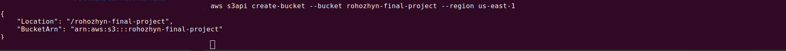

then

```
$ terraform init
```

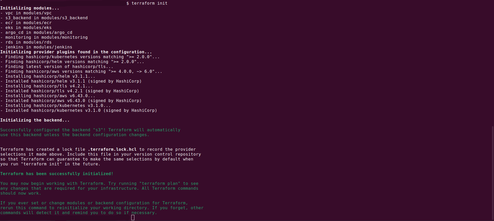

```
$ terraform apply

```

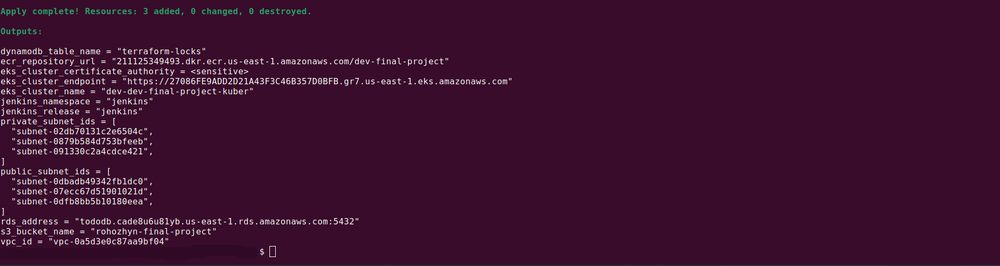

next step its update kuberconfig because we have a new kubernetes cluster

```
$ aws eks update-kubeconfig --name dev-dev-final-project-kuber
```

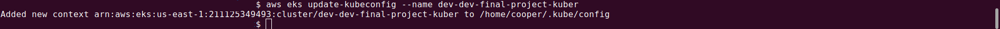

### Check Resourses

```
$ kubectl get all -n jenkins
```
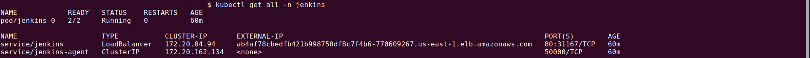

```
$ kubectl get all -n argocd
```
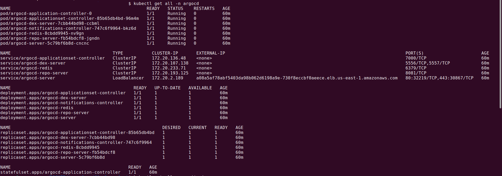

```
$ kubectl get all -n monitoring
```
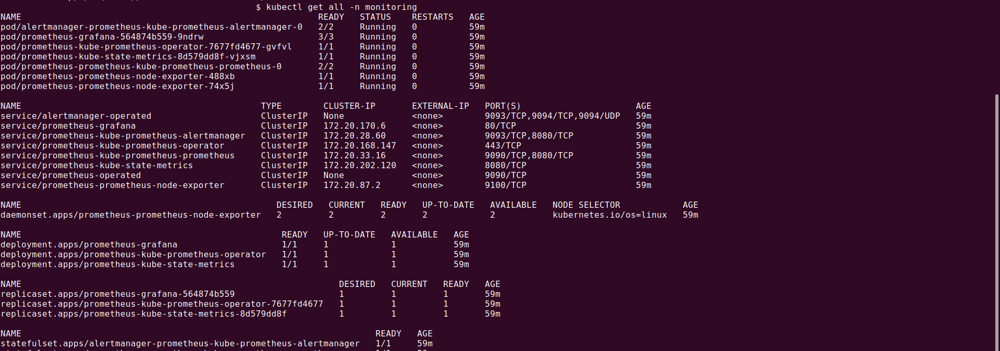

### Jenkins
```
$ kubectl port-forward svc/jenkins 8080:80 -n jenkins
```

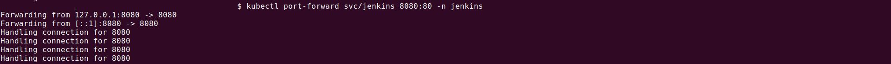

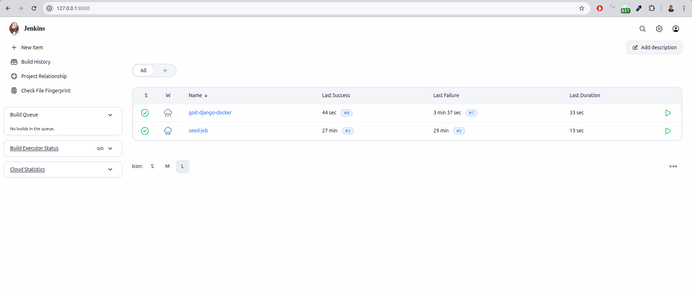

### Argo
```
$ kubectl port-forward svc/argocd-server 8081:443 -n argocd
```
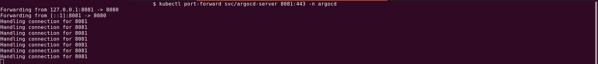

```
# admin password:
$ kubectl -n argocd get secret argocd-initial-admin-secret \
  -o jsonpath="{.data.password}" | base64 -d
```
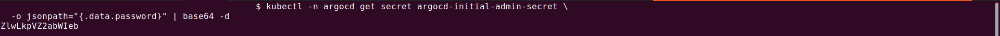


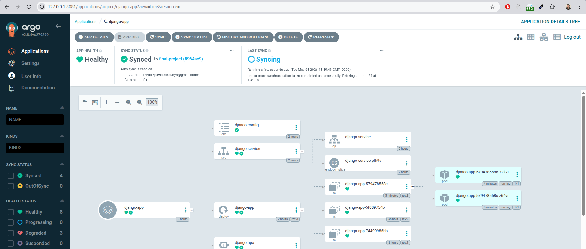

### Django  

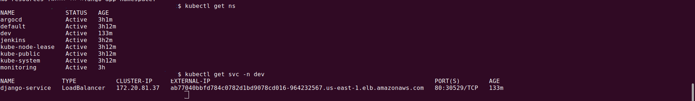

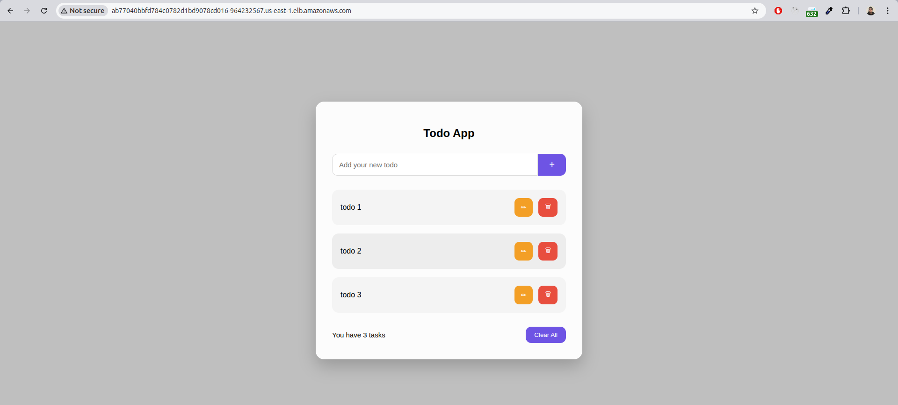

### Database

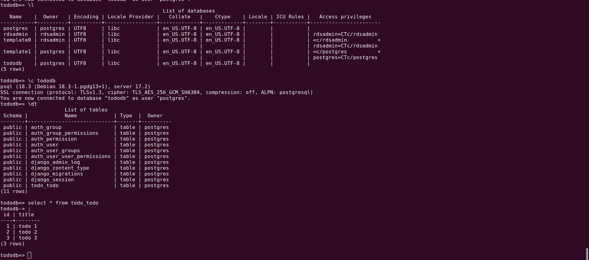

### Monitoring (Grafana and Prometheus)
Monitoring runs inside the cluster (ClusterIP). To access it from a browser, run the following commands (the gateway will be active as long as the terminal is open):
```
$ kubectl port-forward svc/prometheus-grafana 3000:80 -n monitoring
```
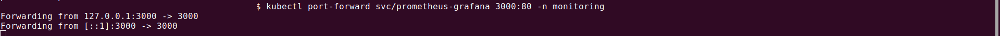

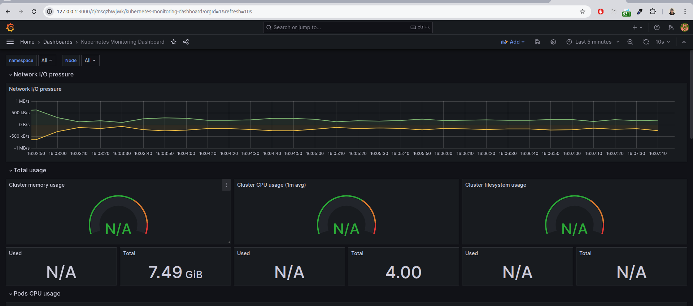


### Destroy

```
$ terraform destroy
```
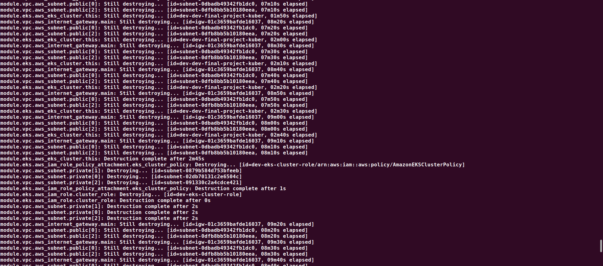
