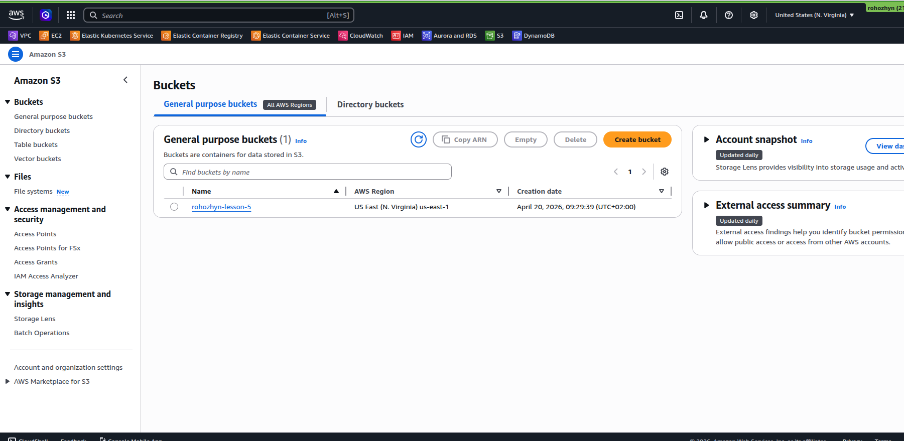
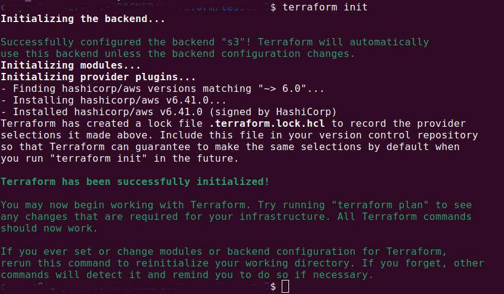
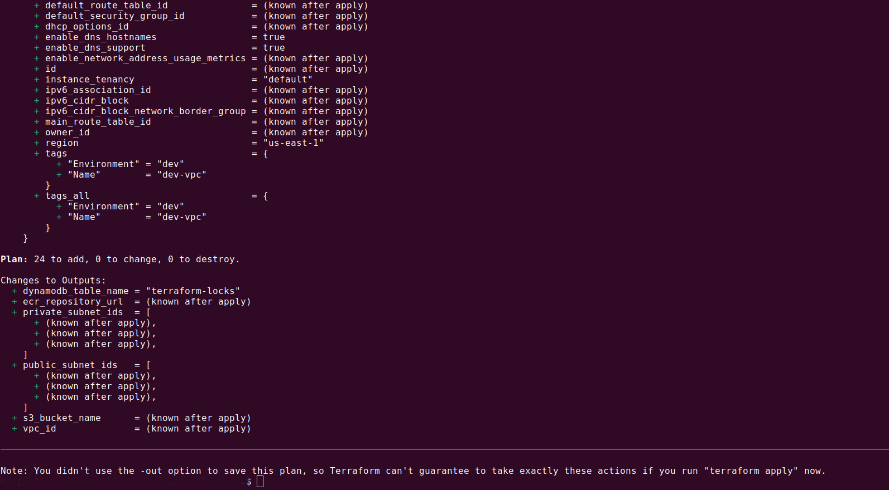
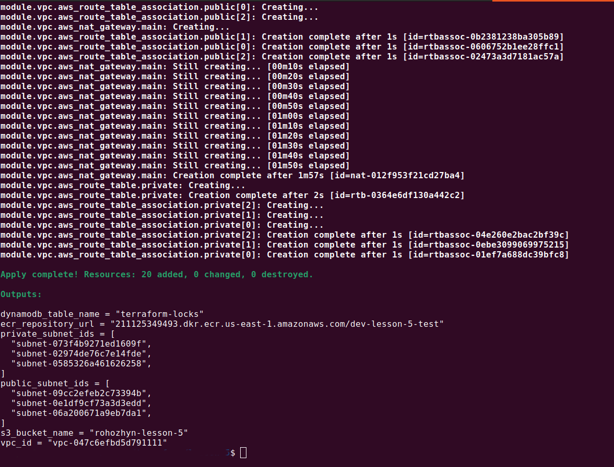
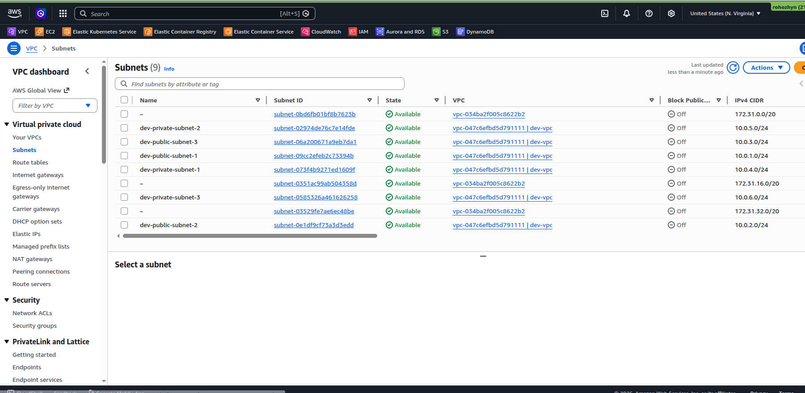
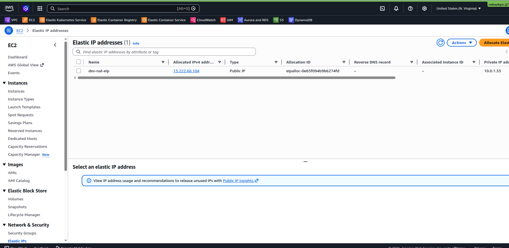
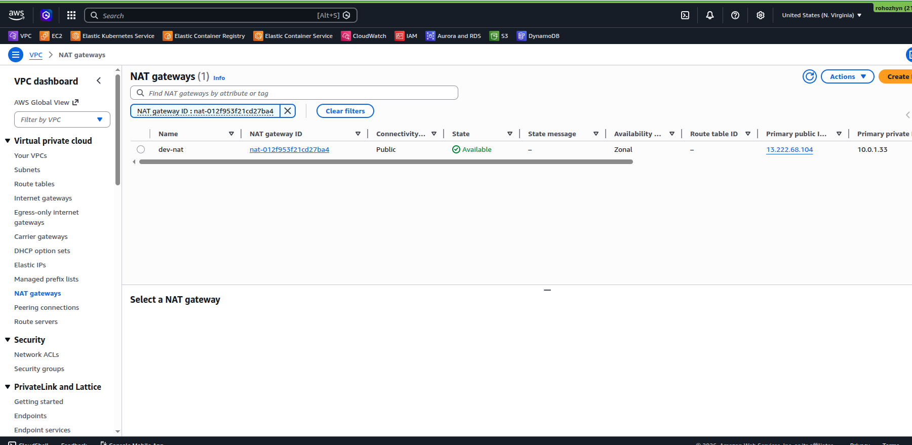
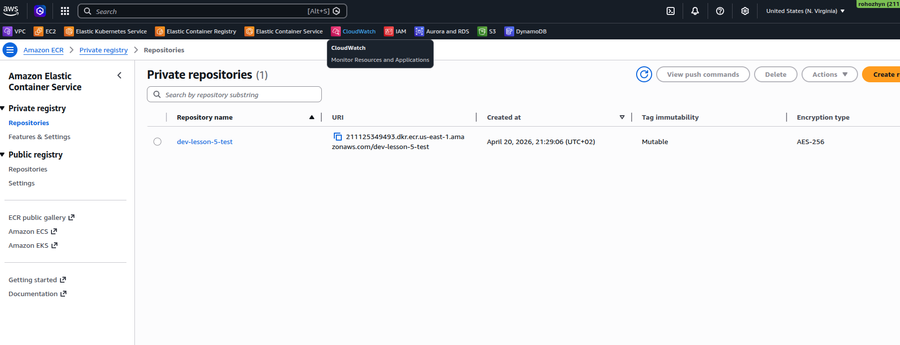
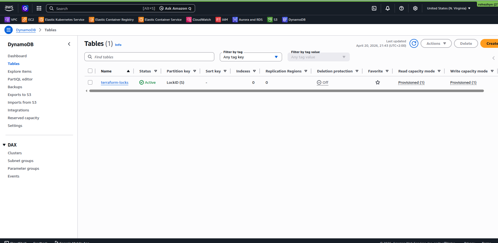
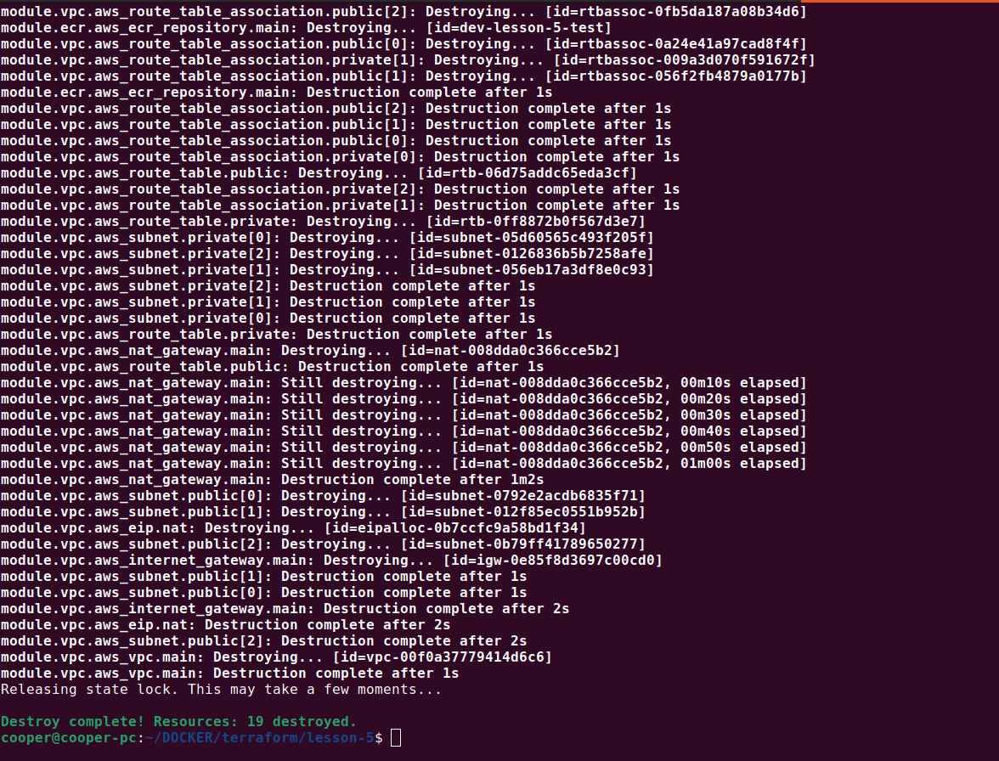

[Back to list](./../readme.md)

[Task Definition](./task/readme.md)

# Terraform for AWS

- S3 Bucket for state
- Dynamydb for lock (only one person can works)
- VPC public (3 items) and private (3 items) subnets
- ECR (Elastic Container Registry) for Docker-images.
- Elastic IP (1 item)
- NAT Gateway (for Internet access from private subnets)

Sometimes when S3 doesnt created we can retrieve en error, im use next

```
aws s3 mb s3://my-uniq-bucket-name

```



then

```
terraform init
```



```
terraform plan
```



```
terraform apply

```



## Terraform Apply Result

### VPC



### ElasticIP



### NAT Gateway



### Elastic Container Service



### Dynamo DB



```
terraform destroy
```



After this command all data will be deleted `BUT` not S3 bucket, S3 bucket should deleted manually (use AWS web console)
