[Back to list](./../readme.md)

[Task Definition](./task/readme.md)

# Terraform for AWS

- S3 Bucket for state
- Dynamydb for lock (only one person can works)
- VPC public (3 items) and private (3 items) subnets
- ECR (Elastic Container Registry) for Docker-images.
- Elastic IP (1 item)
- NAT Gateway (for Internet access from private subnets)
- EKS (Elastic Kubernetes Service)
- `new` Jenkins (for build and push docker container to ECR)
- `new` ArgoCD (sync cluster-kuber django-app, if git codebase was changed, like new PR in main branch )

First off all im creating `S3 bucket`, im use next aws terminal command

```
$ aws s3api create-bucket --bucket rohozhyn-lesson-8-9 --region us-east-1

```

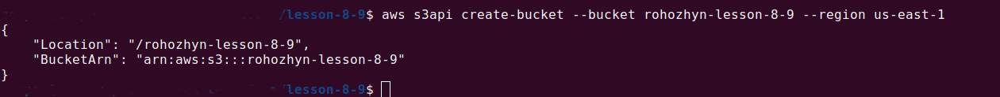

then

```
terraform init
```

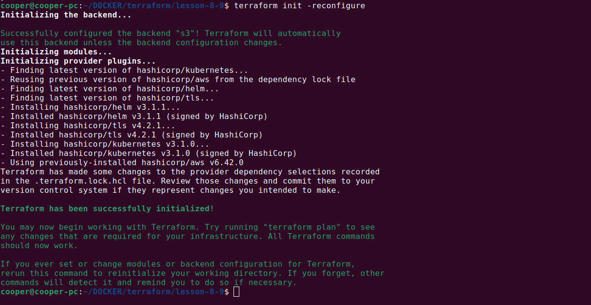

```
terraform plan
```

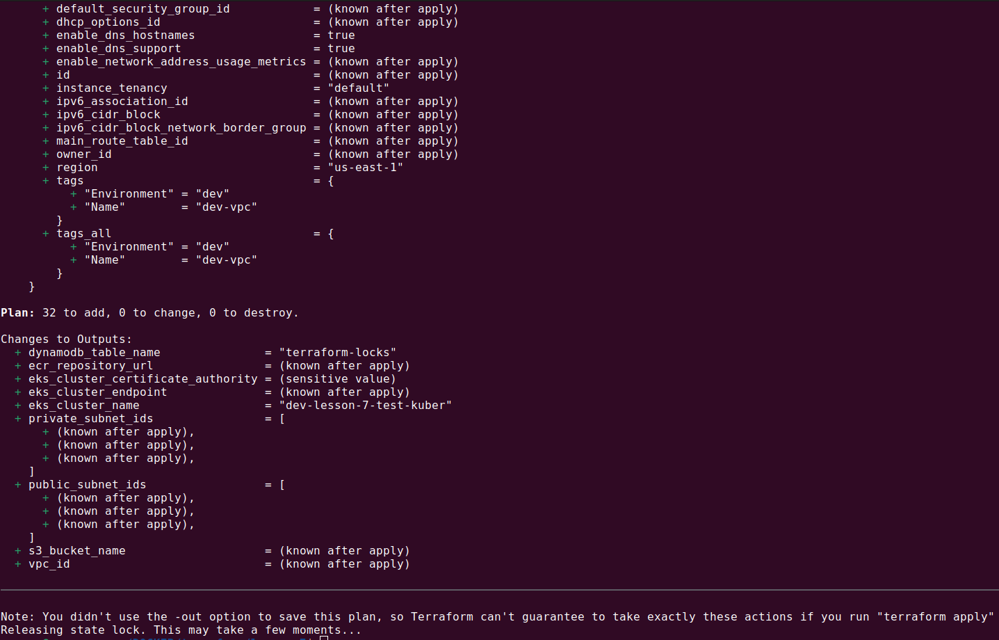

Before command `terraform apply` im preparing django application from `lessons 4`. According to requerements we should use <a href="https://helm.sh/docs/intro/install/" target="_blank">helm</a> and <a href="https://kubernetes.io/docs/tasks/tools/install-kubectl-linux/" target="_blank">kubectl</a>

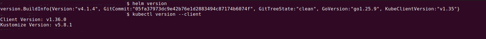

Next need to prepare `docker image` for `ECR`, i take my `Django app` which i made in `lesson 4` and base on this app Im doing image

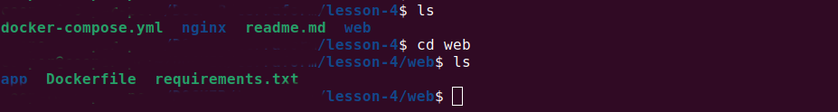

run command

```
docker build -t django-app .
```

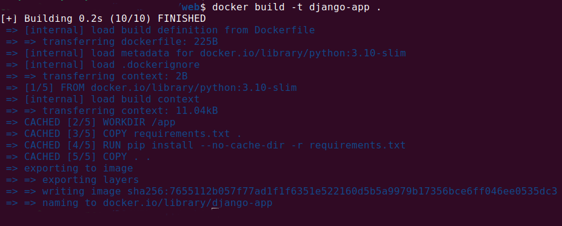

```
docker images
```

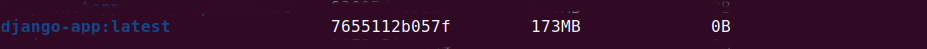

and now we can continue with terraform

```
terraform apply

```

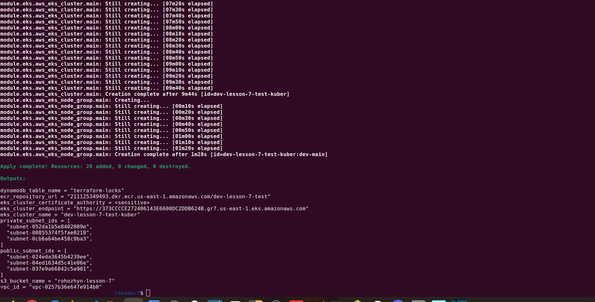

VPC

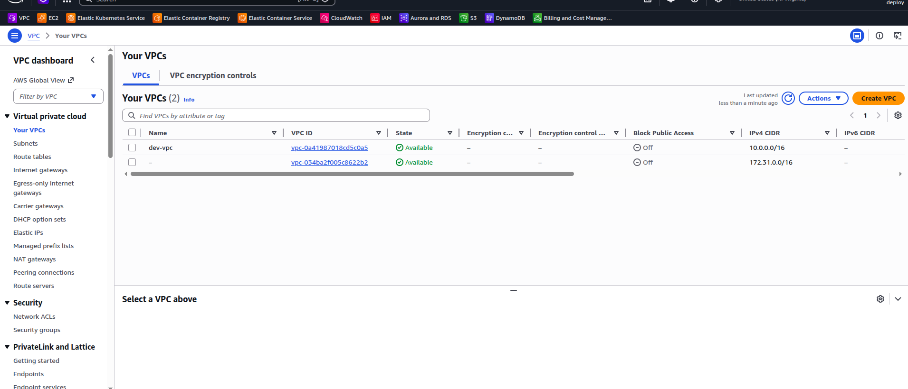

SUBNETS

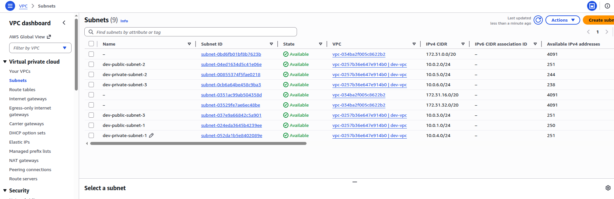

APP in ECR

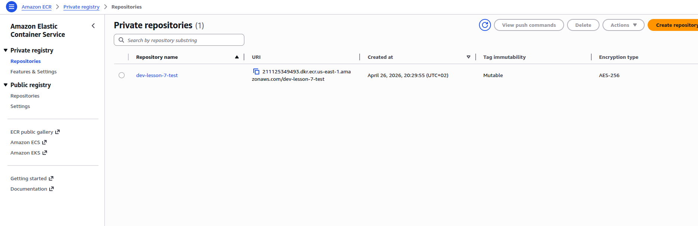


EKS

now we have `EKS` (eks_cluster_endpoint) and `ECR` (ecr_repositary_url) endpoints

lets upload `docker image` (django-app) to `ECR`, if need do login

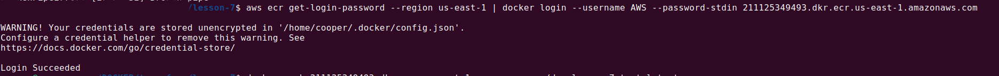

then create tag for docker-image and push to registry

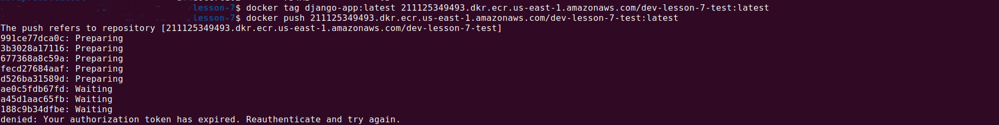

lets install app via `helm`

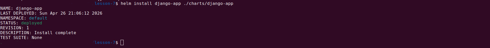

and the last its inspect a `aws kubernetes`

```
aws eks update-kubeconfig --region us-east-1 --name <name-of-cluster> !!!!
```

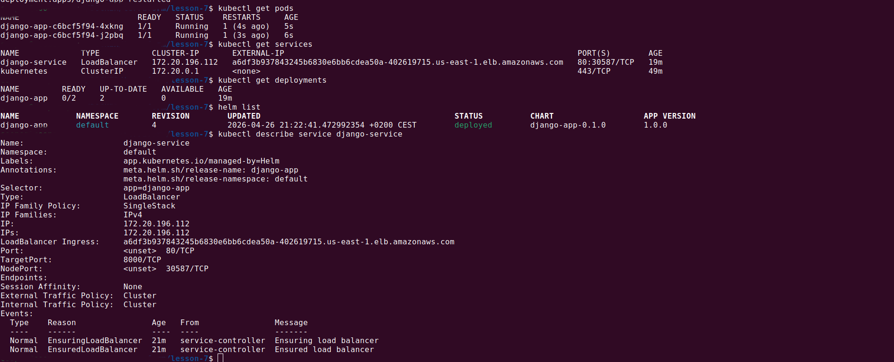

!!! DONT FORGET `helm uninstall` firstly

```
terraform destroy
```

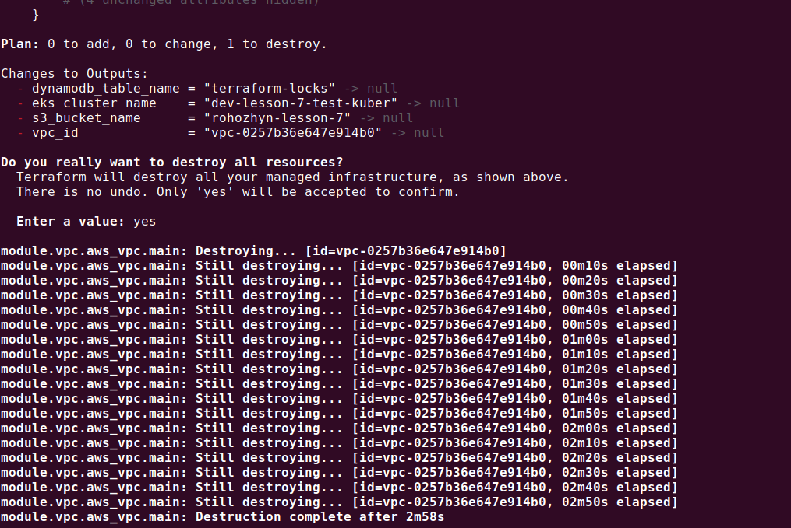

After this command all data will be deleted `BUT` not `S3 bucket`, `S3` bucket should deleted manually (use `AWS` web console)
