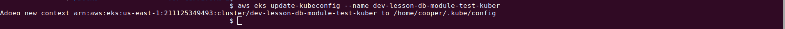
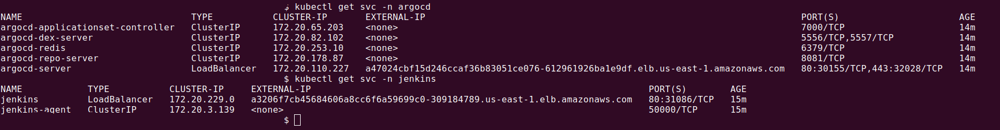
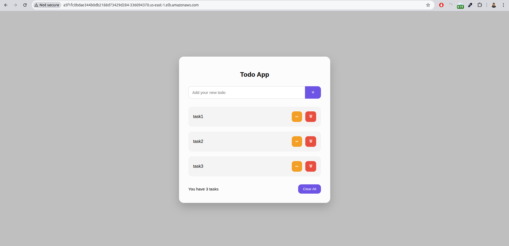
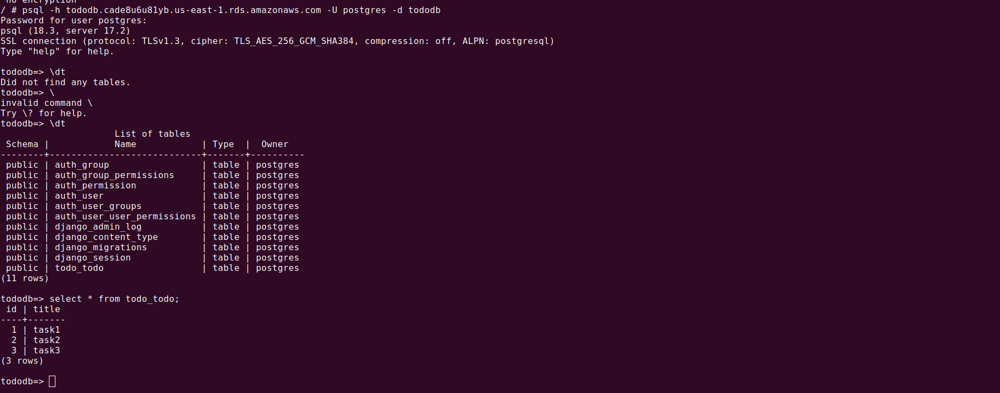

[Back to list](./../readme.md)

[Task Definition](./task/readme.md)

# Terraform for AWS

- S3 Bucket for state
- Dynamydb for lock (only one person can works)
- VPC public (3 items) and private (3 items) subnets
- ECR (Elastic Container Registry) for Docker-images.
- Elastic IP (1 item)
- NAT Gateway (for Internet access from private subnets)
- EKS (Elastic Kubernetes Service)
- Jenkins (for build and push docker container to ECR)
- ArgoCD (sync cluster-kuber django-app, if git codebase was changed, like new PR in main branch )
- `new` rds module

### Tech Stach

 - Infrastructure as Code `Terraform`
 - Cloud Provider `AWS (EKS, ECR, VPC, S3, DynamoDB)`
 - Kubernetes `Amazon EKS (t3.small nodes)`
 - CI (Image Build) `Jenkins + Kaniko`
 - CD (Deployment) `Argo CD`
 - Package Manager `Helm`
 - Application `Django + PostgreSQL`
 - Image Registry `Amazon ECRDatabaseAmazon RDS (PostgreSQL / Aurora)`

### CI/CD schema (FLOW)

```
change code in GitHub
       │
       ▼
  Jenkins Pipeline
  ┌─────────────────────────────────┐
  │ 1. Kaniko: build Docker-image   │
  │ 2. push in to AWS ECR           │
  │ 3. update tag in values.yaml    │
  │ 4. push changes in GitHub       │
  └─────────────────────────────────┘
       │
       ▼
  Git repo (values.yaml updated)
       │
       ▼
  Argo CD (automatically detects changes)
       │
       ▼
  Kubernetes (EKS): start to deploy a new version
```


### Project Structure

```
Teraform repositary 

├── backend.tf                # Terraform backend (S3 + DynamoDB)
├── charts
│   └── django-app # Django application Helm chart
│       ├── Chart.yaml
│       ├── templates
│       │   ├── configmap.yaml
│       │   ├── deployment.yaml
│       │   ├── hpa.yaml
│       │   ├── migration-job.yaml
│       │   └── service.yaml
│       └── values.yaml
├── imgs
├── main.tf                   # Connection of all modules
├── modules
│   ├── argo_cd               # Argo CD (Helm) + Application CRDs + Helm chart
│   ├── ecr                   # ECR repository for Docker images
│   ├── eks                   # EKS cluster + node group + EBS CSI driver
│   ├── jenkins               # Jenkins (Helm) + IRSA for ECR + JCasC
│   ├── rds                   # Universal RDS module (Aurora or Standard)
│   │   ├── aurora.tf         # Aurora Cluster + Writer + Reader replicas
│   │   ├── outputs.tf        # Endpoint outputs
│   │   ├── rds.tf            # Standard aws_db_instance (use_aurora = false)
│   │   ├── shared.tf         # DB Subnet Group + Security Group (shared)
│   │   └── variables.tf      # All module variables
│   ├── s3_backend            # S3 for state + DynamoDB for locking
│   └── vpc                   # VPC, public/private subnets, NAT
├── outputs.tf                # Resource outputs
├── README.md
├── task
├── terraform.tfvars          # PDA github-token
├── terraform.tfvars.example
└── variables.tf
```


```
Django app repositary
.
├── docker-compose.yml
├── Dockerfile
├── entrypoint.sh
├── Jenkinsfile               # CI pipeline (build, push, tag update)
├── nginx.conf
├── README.md
├── requirements.txt
└── src
    ├── config                # django application folder (setting.py)
    ├── entrypoint.sh
    ├── manage.py
    ├── static
    ├── staticfiles
    └── todo                  # todo application
        ├── admin.py
        ├── apps.py
        ├── models.py
        ├── templates
        ├── tests.py
        ├── urls.py
        └── views.py
```

### Step-byStep

First off all im creating `S3 bucket`, im use next aws terminal command

```
$ aws s3api create-bucket --bucket rohozhyn-lesson-db-module --region us-east-1
```


then

```
terraform init
```


Before command `terraform apply` im preparing django application from `lessons 4`. Im create independent repo with django application (<a href="https://github.com/PavloRohozhyn/django-app-for-terraform-1.git">django-app-for-terraform-1</a>) and create there Jenkinsfile for CI/CD process

```
terraform apply

```


next step its update kuberconfig because we have a new kubernetes cluster

```
$ aws eks update-kubeconfig --name dev-lesson-db-module-test-kuber
```



lets get links for jenkins and argocd



### Jenkins


### Argo


### Django  



### Database




### RDS module

The `RDS` module is universal: depending on the `use_aurora` variable, it launches either a standard `RDS instance` or a full-fledged `Aurora cluster` with writer and reader replicas.

 - `use_aurora=false` (by default) - standart RDS (mysql/postgres)
 - `use_aurora=true` - Aurora cluster instance 


### example of Aurora

```
module "rds" {
  source = "./modules/rds"
  name       = "app-database"
  use_aurora = true

  # Aurora
  engine_cluster                = "aurora-postgresql"
  engine_version_cluster        = "17.2"
  parameter_group_family_aurora = "aurora-postgresql17"
  aurora_replica_count          = 2   # count of nodes (read)

  # common 
  instance_class          = "db.t3.medium"
  db_name                 = "appdb"
  username                = "postgres"
  password                = var.db_password  # sensetive
  vpc_id                  = module.vpc.vpc_id
  subnet_private_ids      = module.vpc.private_subnets
  subnet_public_ids       = module.vpc.public_subnets
  publicly_accessible     = false
  backup_retention_period = 7

  parameters = {
    max_connections            = "200"
    log_min_duration_statement = "500"
  }

  tags = {
    Environment = "production"
    Project     = "appname"
  }
}
```

### example of Standard RDS

```
module "rds" {
  source = "./modules/rds"
  name       = "appdb-dev"
  use_aurora = false  # switch to standatd RDS
  engine                     = "postgres"
  engine_version             = "17.2"
  parameter_group_family_rds = "postgres17"
  instance_class          = "db.t3.micro"
  allocated_storage       = 20
  db_name                 = "appdb"
  username                = "postgres"
  password                = var.db_password
  vpc_id                  = module.vpc.vpc_id
  subnet_private_ids      = module.vpc.private_subnets
  subnet_public_ids       = module.vpc.public_subnets
  multi_az                = false
  backup_retention_period = 1
  tags = {
    Environment = "dev"
  }
}
```


### Variable Description

 - `name` `string` (—) - Unique name for the instance/cluster (resource identifier)
 - `use_aurora` `bool/false` - (true) → Aurora cluster, `false` → standard RDS
 - `engine` `string` ("postgres") - Engine for standard RDS (postgres, mysql)
 - `engine_version` `string` ("17.2") - Engine version for standard RDS
 - `parameter_group_family_rds` `string` ("postgres17") - Family for standard RDS parameter group
 - `engine_cluster` `string` ("aurora-postgresql") - Engine for Aurora cluster
 - `engine_version_cluster` `string` ("17.2") - Engine version for Aurora 
 - `parameter_group_family_aurora` `string` ("aurora-postgresql17") - Family for Aurora parameter group
 - `aurora_replica_count` `number` (1) - Number of reader replicas in Aurora
 - `instance_class` `string` ("db.t3.micro") - Instance class (db.t3.micro, db.t3.medium, etc.)
 - `allocated_storage` `number` (20) - Disk size in GB (Standard RDS only)
 - `db_name` `string` (—) - Name of the database to be created
 - `username` `string` (—) - Master username
 - `password` `string` (—) - Master password (sensitive)
 - `vpc_id` `string` (—) - VPC ID 
 - `subnet_private_ids` `list(string)` (—) - Private subnet IDs
 - `subnet_public_ids` `list(string)` (—) - Public subnet IDs
 - `publicly_accessible` `bool` (false) - Whether the DB is accessible from the internet
 - `multi_az` `bool` (false) - Multi-AZ for standard RDS
 - `backup_retention_period` `string` ("") - Number of days to retain backup
 - `sparameters` `map(string)` ({}) - DB parameter group settings
 - `tags` `map(string)` ({}) - Tags for all module resources

How to change `DB type`, `engine` or `instance class`
Switch from Aurora to standard RDS:
```
use_aurora = false
engine = "postgres"
engine_version = "17.2"
parameter_group_family_rds = "postgres17"
```

Switch to MySQL:
```
use_aurora = false
engine = "mysql"
engine_version = "8.0"
parameter_group_family_rds = "mysql8.0"
```

Increase instance class:
```
instance_class = "db.r6g.large" # for production Aurora
```

Add DB parameters:
```
parameters = {
  max_connections = "500"
  log_min_duration_statement = "1000"
  work_mem = "65536"
}
```