[Back to list](./../readme.md)

[Task Definition](./task/readme.md)

# Terraform for AWS

- S3 Bucket for state
- Dynamydb for lock (only one person can works)
- VPC public (3 items) and private (3 items) subnets
- ECR (Elastic Container Registry) for Docker-images.
- Elastic IP (1 item)
- NAT Gateway (for Internet access from private subnets)
- EKS (Elastic Kubernetes Service)
- Jenkins (for build and push docker container to ECR)
- ArgoCD (sync cluster-kuber django-app, if git codebase was changed, like new PR in main branch )
- `new` rds module


First off all im creating `S3 bucket`, im use next aws terminal command

```
$ aws s3api create-bucket --bucket rohozhyn-lesson-db-module --region us-east-1

```

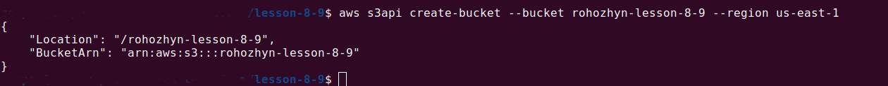

then

```
terraform init
```

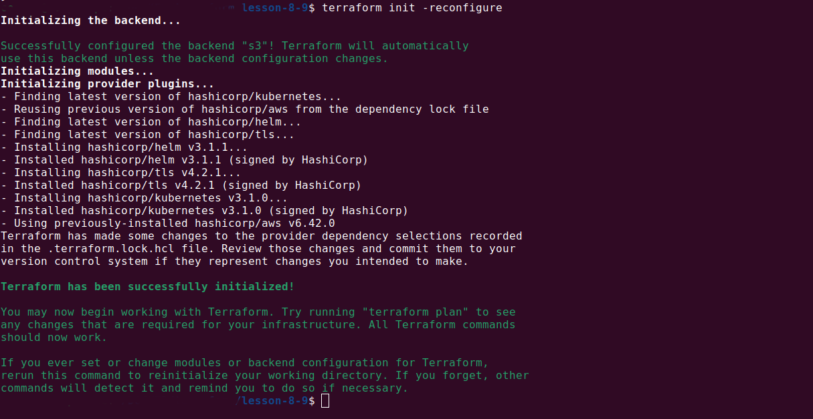

```
terraform plan
```

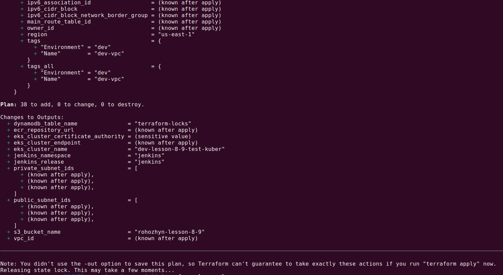

Before command `terraform apply` im preparing django application from `lessons 4`. Im create independent repo with django application (<a href="https://github.com/PavloRohozhyn/django-app-for-terraform.git">django-app-for-terraform</a>) and create there Jenkinsfile for CI/CD process

```
terraform apply

```

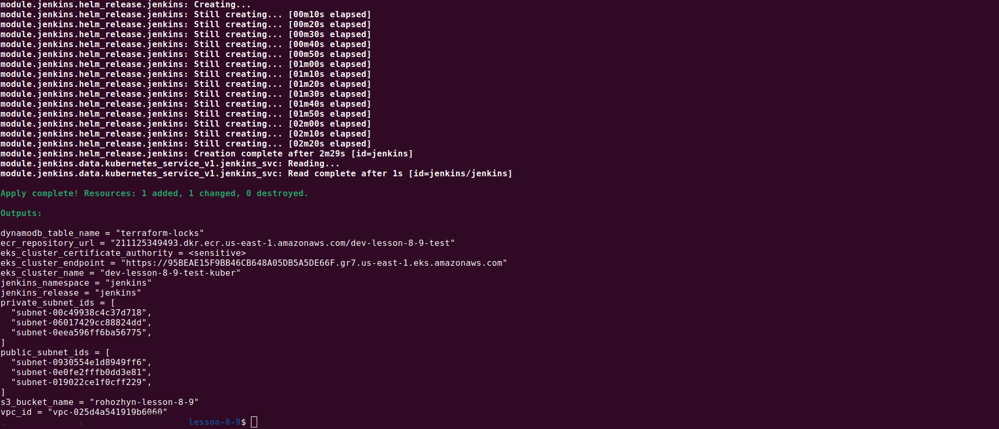


And NOW! lets check what was created ))), firstly update kuberconfig because we have a new kubernetes cluster

```
aws eks update-kubeconfig --name dev-lesson-8-9-test-kuber
```

VPC


SUBNETS

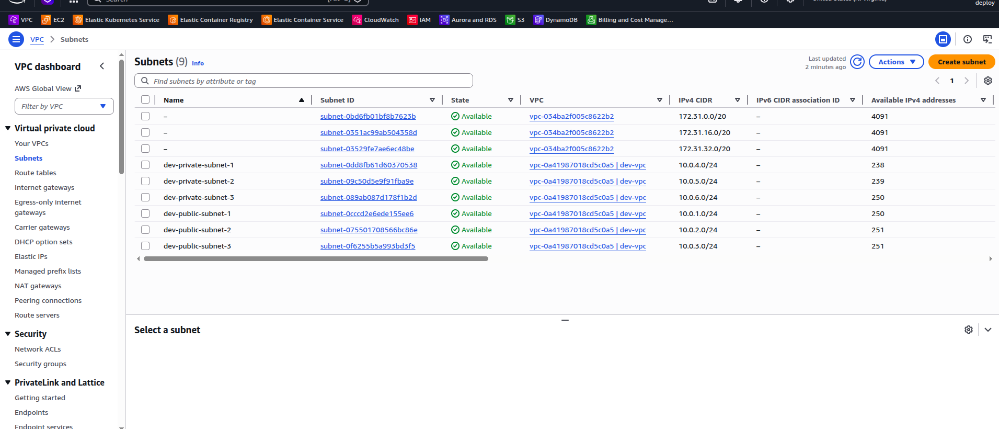

APP in ECR

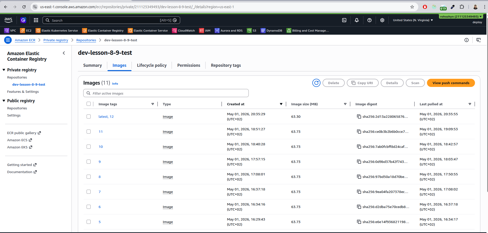

EKS (this screen is old and was made several days ago,  in reals im instaled 1.35 )

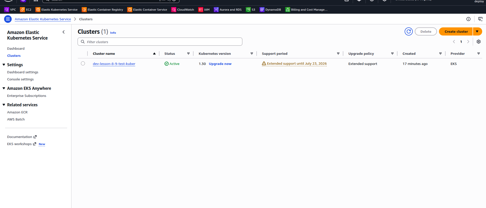

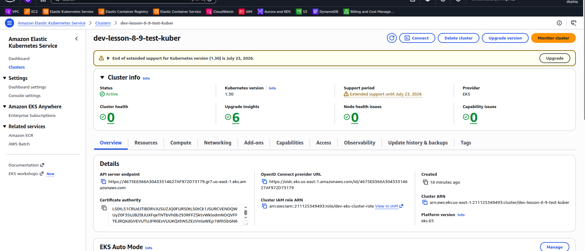

then i spend a lot of time to config `jenkins` and `argo` connect from `external ip` and im made port forvarding for fast (temperary) design 


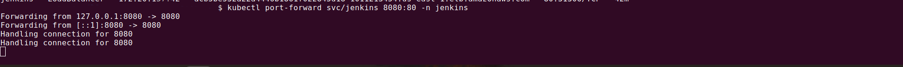


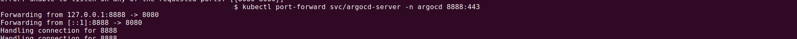

and now we have access to `jenkins` with defult jobs (were trouble with docker container and 12-th release was without errors)

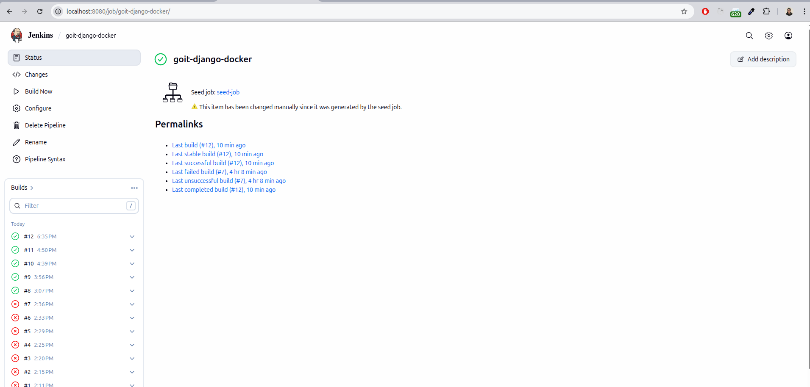

and `argocd` with kubernetis maps

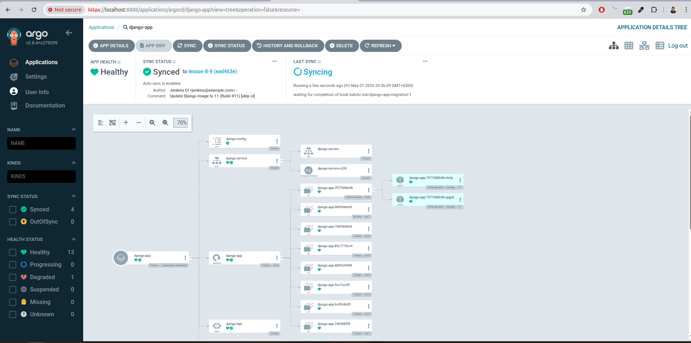

and `django app` on public DNS (only `http`)

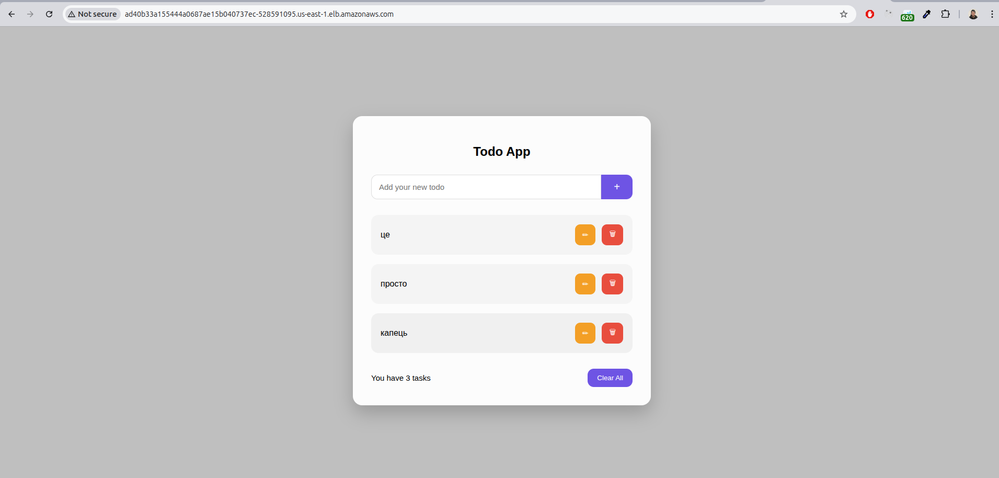


```
terraform destroy
```

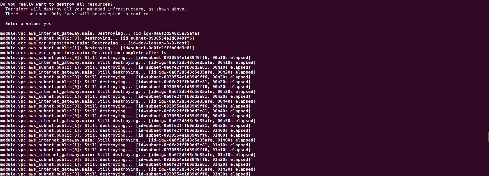

After this command all data will be deleted `BUT` not `S3 bucket`, `S3` bucket should deleted manually (use `AWS` web console)


BUDGET ))) 

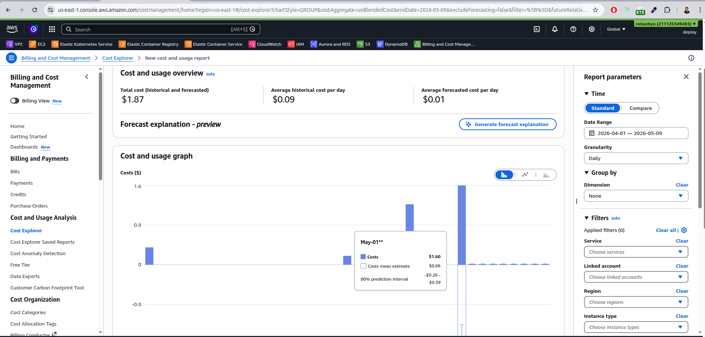
